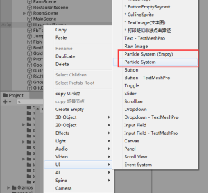
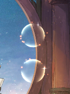
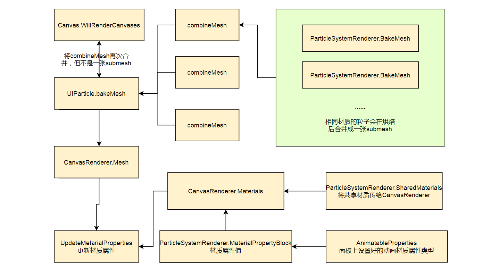
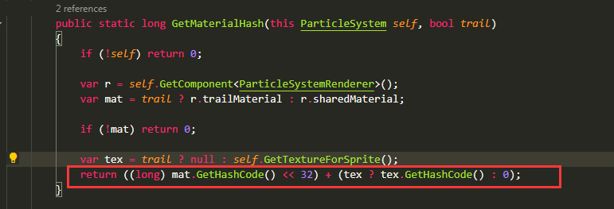
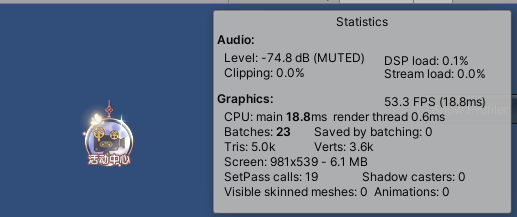
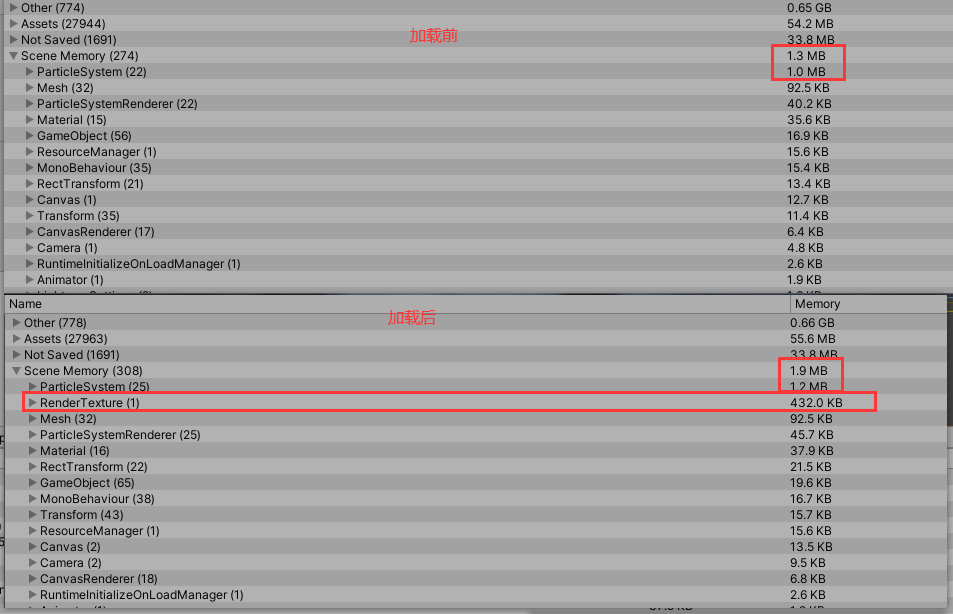
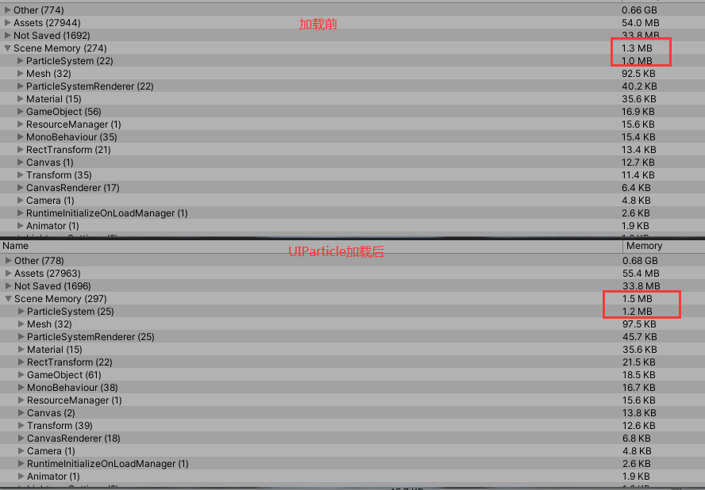
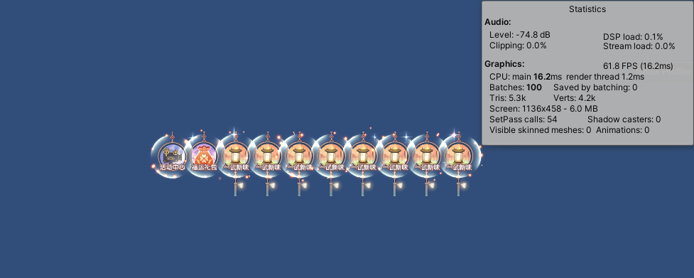
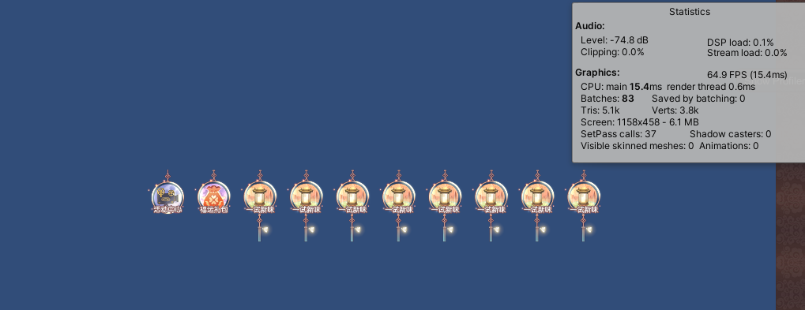
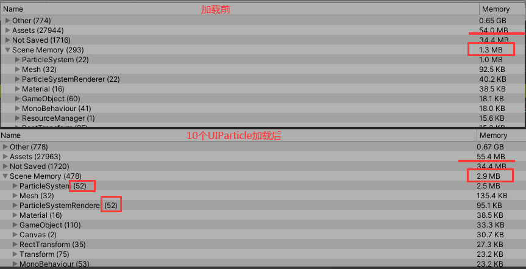

# ParticleEffectForUGUI（UIParticle）

## 一、概述

ParticleEffectForUGUI插件，又名UIParticle，为UGUI渲染可遮罩、可排序的粒子特效，而且不需要额外摄像机、RT和Canvas。Unity 2018.2及以上版本支持。

<!-- more -->

官方对其的使用和与其他方案对比的优缺点已给出详细说明，了解请访问[ParticleEffectForUGUI](https://github.com/mob-sakai/ParticleEffectForUGUI "ParticleEffectForUGUI")。

下面研究如何引入到项目中使用，Unity版本是2019.4.35f1，并且和项目现使用的RT粒子特效方案做性能对比。

## 二、引入项目

#### 1.导入package

使用manifest.json添加依赖方式导入。

```c#
-- manifest.json
dependencies:{
  "com.coffee.ui-particle": "[https://github.com/mob-sakai/ParticleEffectForUGUI.git#3.3.10](https://github.com/mob-sakai/ParticleEffectForUGUI.git#3.3.10)",
}
```

\#3.3.10代表版本号。refresh一下就会导入package。

#### 2.添加UIParticle组件

gameObject右键-UI中可以添加UIParticle组件。



也可以将目前项目里的UI Effect Prefab转换成用UIParticle的方式，在其根节点上添加UIParticle组件即可。




两者效果一致，而且UIParticle方式的特效可以自由缩放大小。

#### 3.编写工具类，在lua层加载UIParticle并显示

```lua
-- UIParticle.lua
module("logic.common.ugui.UIParticle", package.seeall)
 
local UIParticle = class("UIParticle")
 
function UIParticle:ctor(container)
    self._go = container.gameObject
    self._loader = PrefabLoader.Get(self._go)
    self._url = nil
    self._goInst = nil
end
 
function UIParticle:load(url)
    if GameUtils.isEmptyString(url) then
        return
    end
    if url == self._url then
        return
    end
    self._url = url
    self._loader:load(url, self._onResLoaded, self)
end
 
function UIParticle:_onResLoaded(loader)
    local goInst = loader and loader:getInst()
    if goutil.isNil(goInst) then
        return
    end
    goutil.addChildToParent(goInst, self._go)
    self._goInst = goInst
    self._comUIParticle = goInst:GetComponent(typeof(Coffee.UIExtensions.UIParticle))
    if self._effectLoadedCallback then
        if self._effectLoadedCallbackObj then
            self._effectLoadedCallback(self._effectLoadedCallbackObj, goInst, res)
        else
            self._effectLoadedCallback(goInst, res)
        end
    end
    --检查美术是否有挂载EffectPlayer的组件
    local _effectCSComp = goInst:GetComponent(typeof(Pjg.EffectPlayer))
    if _effectCSComp and not goutil.isNil(_effectCSComp) then
        --参数默认以组件的，暂不支持外部设置参数
        _effectCSComp:AddFinishListener(self._onEffectPlayFinish, self)
        --加载好就立即执行play
        _effectCSComp:Play()
    end
end
 
--暂时没有全部播放完毕逻辑回调
function UIParticle:_onEffectPlayFinish()
    if goutil.isNil(self._go) then
        return
    end
    if self._effectFinishCallback then
        if self._effectFinishCallbackObj then
            self._effectFinishCallback(self._effectFinishCallbackObj, self)
        else
            self._effectFinishCallback()
        end
    end
end
 
function UIParticle:clear()
    if goutil.isNil(self._goInst) then
        return
    end
    --检查美术是否有挂载EffectPlayer的组件
    local _effectCSComp = self._goInst:GetComponent(typeof(Pjg.EffectPlayer))
    if _effectCSComp and not goutil.isNil(_effectCSComp) then
        _effectCSComp:Stop()
        _effectCSComp:RemoveFinishListener()
    end
end
 
function UIParticle:OnDestroy()
    self:clear()
    self._go = nil
    self._loader = nil
    self._url = nil
    self._goInst = nil
    self._effectLoadedCallback = nil
    self._effectLoadedCallbackObj = nil
    self._effectFinishCallback = nil
    self._effectFinishCallbackObj = nil
end
 
function UIParticle:getGo()
    return self._go
end
 
function UIParticle:setEffectLoadedCallback(callback, callbackObj)
    self._effectLoadedCallback = callback
    self._effectLoadedCallbackObj = callbackObj
end
 
function UIParticle:setEffectFinishCallback(callback, callbackObj)
    self._effectFinishCallback = callback
    self._effectFinishCallbackObj = callbackObj
end
 
function UIParticle:play()
    if goutil.isNil(self._goInst) then
        return
    end
    if self._goInst.activeSelf then
        goutil.setActive(self._goInst, false)
    end
    goutil.setActive(self._goInst, true)
    --检查美术是否有挂载EffectPlayer的组件
    local _effectCSComp = self._goInst:GetComponent(typeof(Pjg.EffectPlayer))
    if _effectCSComp and not goutil.isNil(_effectCSComp) then
        _effectCSComp:Stop()
        _effectCSComp:RemoveFinishListener()
        --参数默认以组件的，暂不支持外部设置参数
        _effectCSComp:AddFinishListener(self._onEffectPlayFinish, self)
        _effectCSComp:Play()
    end
end
 
function UIParticle:setScale(scale)
    self._comUIParticle.scale = scale
end
 
function UIParticle:setPos(x, y, z)
    GameUtils.setLocalPos(self._goInst, x, y, z or 0)
end
 
return UIParticle
```

功能包括加载uiParticle Prefab，改变大小和位置。

测试能够正常显示：


## 三、UIParticle实现原理



1.会先将粒子系统的共享材质传给CanvasRenderer

2.在Canvas刷新前事件函数里，将粒子系统的网格经过烘焙后合并，将合并的烘焙网格传给CanvasRenderer.Mesh

3.刷新材质属性时，从粒子系统材质上拿到材质属性数据，根据面板上设置好的动画材质属性类型，依次传给CanvasRenderer上的材质。

4.相同材质的粒子会烘焙成网格并合并，UIParticle在烘焙前会对粒子排序，按材质实例ID、渲染队列、渲染顺序等排序，合并网格时将计算材质的hashCode，相等才能一起合并。



## 四、性能对比

UIParticle和RT特效方式进行性能对比

#### 1.单个UI粒子特效对比




左边UIParticle，右边RT。

两者面数一样，UIParticle比RT方式少1个batches，其实差不多。

对比内存：

**1.1256\*144RT与UIParticle内存占用对比：**



256\*144的RT特效内存加载情况，rt不是很大，只是占432kb。



UIParticle内存特效加载后，scene memory只是上涨了0.2MB，而RT特效上涨0.6MB，RT特效占用较大；RT特效的Assets内存也大了0.2MB。

1.2全屏1560\*720RT和UIParticle内存占用对比：


RT特效加载前后内存对比，可以看出加载后scene memory中rt占的内存较大，一张全屏RT占了近13MB。


UIParticle特效加载前后对比，加载后scene memory中没有rt，内存上升不多。

对比两者可以看出，particleSystem占的内存都一样，而全屏RT所以占用的内存就更明显了。

#### 2.多个相同UI粒子特效对比





左边UIParticle，右边RT。

UIParticle方式特效面数比RT多，batches数也比较多。相比下，RT方式更好。

对比内存：



加载10个UIParticle特效，particleSystem数量增加30（正常），scene memory增加1.6MB，assets增加1.4MB，Other上涨0.02GB。


加个10个同个粒子的RT特效，RT增加一个（共用同一个255\*144大小RT），scene memory增加0.6MB，assets增加0.2MB，Other上涨0.01GB。

明显多个相同粒子特效，内存方面，RT方式优于UIParticle方式。

#### 总结

1.  UI特效单独显示（比如全屏特效等）的情况，选择UIParticle方式。

2.  UI特效多个相同显示，选择RT方式。
