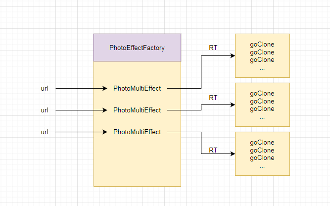

<!-- more -->

# RenderTexture特效系统实现原理
## 一、RenderTexture阐述

食物语中的显示的特效一般是使用RenderTexture结合摄像机拍摄3D物体实现的，实际上游戏中显示的是一张加载好的RT。

什么是RT？为啥RT可以渲染一张动态的图片？

RT是一种特殊的Texture，可以在运行时实现更新内容。网上有句话可以概括：将一个FBO链接到server-side的texture对象上。通俗一点就是将渲染结果应用到gpu上的texture对象上，而texture对象就是游戏中的一张贴图，渲染结果（FBO的数据）可以动态变化，那么贴图的内容也跟着动态变化。

FBO全称：FrameBufferObject，gpu上的一块buffer区域，用来存储渲染结果。一般有个默认的FBO直接连接显示器窗口区域，其他的FBO存储渲染结果供需要时使用，正是这时候，RT作为一块渲染区域应用这些FBO。

server-side：cpu加载贴图资源到内存，叫做client-side；cpu将资源从内存拷贝到gpu中，叫做发送到server-side。

为什么特效需要用RT应用到项目中，而不直接加载呢？

关键的原因是项目中一般在UI上挂特效，特效资源的渲染层跟UI不属于同一个渲染层级，所以总是在UI资源之前或之后，没办法在两个UI资源之间，让特效显示在最上层的话，那么就会挡住比如断线重连这类层级优先级最高的UI。

所以要利用RT渲染特效，作为一个UI资源加载进来。


## 二、RT特效系统设计原理

怎样实现RT特效？

很简单就是创建一个RenderTexture对象，赋值给camera的targetTextrue属性，同时赋值给RawImage对象的texture属性。这就相当于camera将渲染结果（特效的表现）写入到了RenderTexture对象，RawImage对象作为一个显示窗口区域，连接到RenderTexture对象存储数据的FBO。

着点于项目上，RT特效系统是如何设计的，这么设计的原因有是什么呢？先看以下系统关系图：


图中清晰的表达了类之间数据流向，关键的就是传递RT和特效实例，各类发挥的作用：

1. PhotoProducer负责创建RT、摄像机和特效实例的容器TargetContainer，相当于一块特效的渲染场景，而且这个渲染场景跟UI不是同一个渲染层，另外负责把RT传递给PhotoBase的RawImage组件上。
2. PhotoProducerCache作为对象池，管理PhotoProducer的分配和回收。
3. PhotoBase就是作为承载RT的容器，显示在UI上。
4. PhotoMultiEffect负责通过url加载特效资源，并将特效资源实例传递到Pruducer中的TargetContainer容器。

另外这些类通过turnOn和turnOff方法控制特效的显示和隐藏。

- turnOn方法：将Effect Inst加到TargetContainer节点下，将RT跟Camera和RawImage连接起来。
- TurnOff方法：将RawImage置为不可用enable为false，将Effect Inst移出TargetContainer，并且将ProducerContainer置为不可见，归还Producer到对象池以便供其他特效使用。

还有一点，PhotoProducerCache的主要优化手段是将RT缓存起来，用RT的规格（宽高）作为索引来复用RT。项目中规定了RT的几种规则：

```Lua
--最大规格RT尺寸(不能再大了) 1560 * 720
PhotoUtil.MaxRTWidth = 1560
PhotoUtil.MaxRTHeight = 720
--大规格RT尺寸 1280 * 720
PhotoUtil.RTWidth = 1280
PhotoUtil.RTHeight = 720
--中等规格RT尺寸 512 * 288
PhotoUtil.PartRTWidth = 512
PhotoUtil.PartRTHeight = 288
--小规格RT尺寸 256 * 144
PhotoUtil.SmallRTWidth = 256
PhotoUtil.SmallRTHeight = 144
```


这样做应该是为限制RT规则来方便复用吧，而且面对各种规则的RT特效复用可能会出现特效裁边这种问题。


RT特效系统中还处理了一种情况：显示多个同一类特效。

当然RT肯定是同一张，但是需要创建多个PhotoMultiEffect的实例，进而实例化多个特效资源实例，这样就浪费资源了，创建多个特效实例可以省去，我们需要的是多个RT的承载体，也就是多个挂有RawImage组件的GameObject。

所以就有PhotoEffectFactory类，负责管理同一类特效的多处显示情况。




