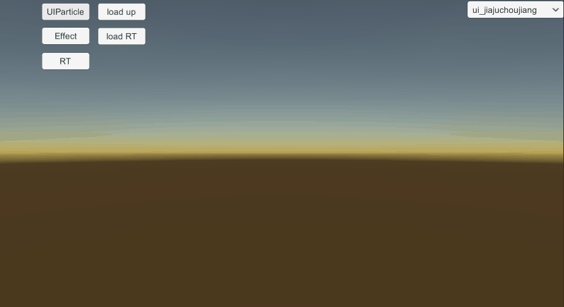
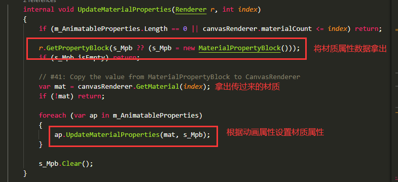
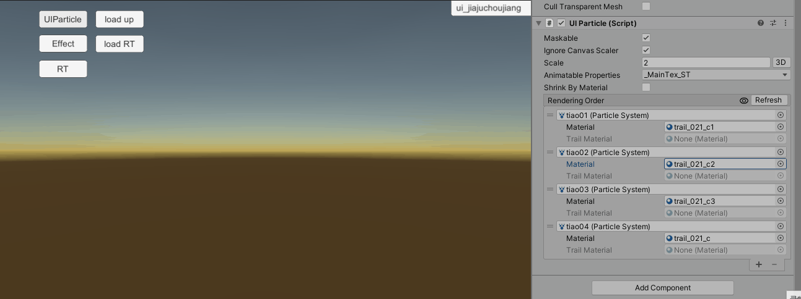
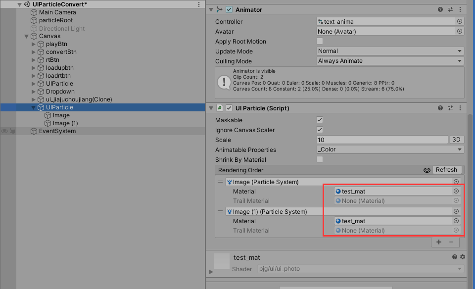
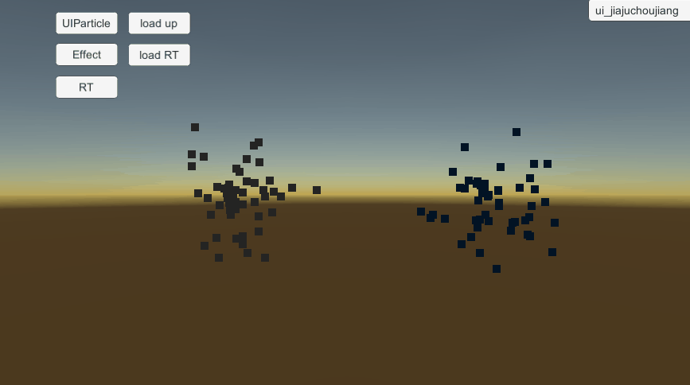
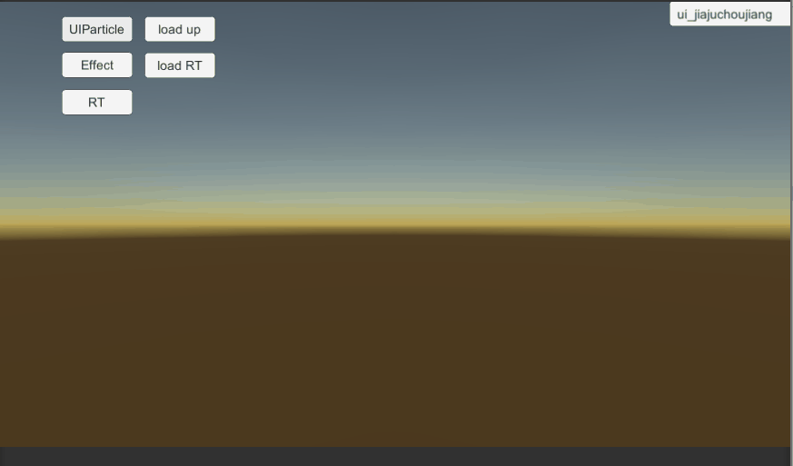

# UIParticle组件的使用问题

## 一、背景

假如能通过代码，对原本的粒子特效prefab，动态添加UIPartcle组件，并且表现效果和RT一样，这样就能够自动化的优化项目中RT特效。

<!-- more -->
## 二、demo测试

写个demo测试效果，各种RT规格特效选取几个，观察转换前后的效果。


## 三、发现问题

没有带动画的特效播放正常，带动画的特效发现几个问题，比如ui\_jiajuchoujiang特效：

1.代码上暂时没有找到更改Animatable Properties属性的接口，只能在Inspector上更改。

2.代码上刚添加UIParticle组件，首次调用RefreshParticles函数刷新没效果。

3.动画控制着材质属性Material.\_Main Tex\_ST，用UIParticle方式播放时，播放的起始时间对不上，一下子全出来没有先后顺序。



上图，Inspector上添加动画属性\_Main Tex\_ST，点击Refresh按钮，然后动画属性\_Main Tex\_ST播放的起始时间不对。

4.当特效下的网格数大于8个时会报警告：Mesh '' has more than the 8 submeshes. Extra submeshes will be ignored.

```lua
Mesh '' has more than the 8 submeshes. Extra submeshes will be ignored.
UnityEngine.StackTraceUtility:ExtractStackTrace ()
Coffee.UIExtensions.UIParticleUpdater:Refresh (Coffee.UIExtensions.UIParticle) (at Library/PackageCache/com.coffee.ui-particle@5a8f1263ef/Scripts/UIParticleUpdater.cs:85)
Coffee.UIExtensions.UIParticleUpdater:Refresh () (at Library/PackageCache/com.coffee.ui-particle@5a8f1263ef/Scripts/UIParticleUpdater.cs:54)
UnityEngine.Canvas:SendWillRenderCanvases ()
```

网格数有限制，大于8个会被忽略，但是效果上看不出啥区别，github上有[提问bug](https://github.com/mob-sakai/ParticleEffectForUGUI/issues/186 "提问bug")，但没有回复。

## 四、问题分析

### 1.为什么粒子材质会同时播放？

查看源码发现，动画材质属性更改是通过从ParticleSystemRenderer拿出ShadeMaterials和MaterialPropertyBlock，传给CanvasRenderer，根据Inspector设置好的Animatable material ProPerties来更新Canvas上的材质。




所以引起问题的是特效的几个节点引用了同一个材质，而这个材质设置数据后，几个节点就同步更新了。

这里应该复制多个同个材质，分别设置上去，观察效果正常了。


上图引用同个材质，材质同时更新了。



上图复制了材质，单独引用，正常了。

为了证实这个问题，可以自制一个UIparticle特效，下面有两种粒子（1白1蓝），都分别引用同一个材质，另外制作一个animator，只改动第一个粒子的材质颜色，由白到黑再到白。




animation上只是改了第一个粒子的材质颜色，但是另一个粒子也受到影响。



### 2.子网格数限制问题

网格数大于8会出现不渲染元素的情况，下图tiao03、tiao04的渲染位置从排在后面调整为排在前面，两种情况都有元素丢失，但排在前面的显示出来了：



暂不清楚为什么要限制8个网格数，使用时注意引用材质不能太多，否则出现显示丢失元素情况。

这个限制估计是CanvasRenderer的限制，写了段测试代码，CanvasRenderer的mesh合并超过8个子网格数：

```lua
using UnityEngine;
using UnityEngine.UI;
 
public class MeshCombineForCanvas : Graphic
{
    private CanvasRenderer m_canvasRenderer ;
    private Mesh m_mesh ;
 
    protected override void Start()
    {
        if (!m_canvasRenderer) {
            m_canvasRenderer = gameObject.GetComponent<CanvasRenderer>() ?? gameObject.AddComponent<CanvasRenderer>();
        }
        m_mesh = CreateMesh();
        // CombineMeshes(m_mesh, 8);
        CombineMeshes(m_mesh, 10);
        m_canvasRenderer.SetMesh(m_mesh);
    }
 
    private Mesh CreateMesh()
    {
        Vector3[] vertices = new Vector3[4];
        vertices[0] = new Vector3(0,0,0);
        vertices[1] = new Vector3(0,0,1);
        vertices[2] = new Vector3(1,0,1);
        vertices[3] = new Vector3(1,0,0);
        int[] triangles = new int[6];
        triangles[0] = 0;
        triangles[1] = 1;
        triangles[2] = 2;
        triangles[3] = 2;
        triangles[4] = 3;
        triangles[5] = 0;
        Mesh mesh = new Mesh();
        mesh.vertices = vertices;
        mesh.triangles = triangles;
        return mesh;
    }
 
    private void CombineMeshes(Mesh meshContainer, int count)
    {
        CombineInstance[] src = new CombineInstance[count];
        for (int i=0; i<count; i++)
        {
            Mesh mesh = CreateMesh();
            CombineInstance inst = new CombineInstance{ mesh = mesh };
            src[i] = inst;
        }
        meshContainer.CombineMeshes(src, false, false) ;
    }
}
```

运行后同样会报Warning：


