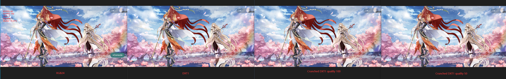

## 前言
微信提供Unity WebGL Transfer工具，将Unity游戏转换发布到小游戏平台。

<!-- more -->
## 测试情况

\*\*1.小游戏平台标识 \*\*

Lua和C#代码要判断小游戏平台来做适配，需要自定义微信小游戏平台标识，单单webgl平台标识不能判断是不是运行在微信小游戏上。

在小游戏打包时候添加symbol预编译宏。

**2.video播放**

游戏中资源加载之后播放video，在小游戏环境中会报错：video.canPlayType is not a function.

网上又解决方案，C#调wx js代码播放video，[链接](https://blog.csdn.net/u013032852/article/details/119605522?spm=1001.2014.3001.5501 "链接")。

\*\*3.Input 输入 \*\*

输入框适配微信，不然捕获不到键盘输入，需要适配，看[连接](https://github.com/wechat-miniprogram/minigame-unity-webgl-transform/blob/main/Design/InputAdaptation.md "连接")。

**4.Touch事件和多点触控检验**

-   *请将WXTouchInputOverride.cs附加到EventSystem对象上，已测试EasyTouch、UGUI、FairGUI可正常工作*&#x20;
-   *NGUI、FairGUI等UI组件内部实现(如NGUI的UICamera.cs)判断touch id<0逻辑分支需删除；在iOS高性能模式下，id可为负数。*

**5.音频**

WebGL底层是利用WebAudio适配，所以Fmod的能力不能完全利用。

*目前音频播放存在占用内存大、播放声音噪声大不稳定的问题*

**6.文件存储**

WebGL将文件存储存储进IndexDB，但是小游戏不支持，需要使用WX C# SDK适配。

参考：WebGL微信小游戏转换-[技术常见问题QA](https://github.com/wechat-miniprogram/minigame-unity-webgl-transform/blob/main/Design/DevelopmentQAList.md "技术常见问题QA")

## 优化记录

| 优化目标                                                                                                                                  | 优化项 |                                                                                                                                                  | 优化建议                                                                                                                                                                                                                                                                                                                                                |
| ------------------------------------------------------------------------------------------------------------------------------------- | --- | ------------------------------------------------------------------------------------------------------------------------------------------------ | --------------------------------------------------------------------------------------------------------------------------------------------------------------------------------------------------------------------------------------------------------------------------------------------------------------------------------------------------- |
| 启动速度&#xA;&#xA;[参考](https://github.com/wechat-miniprogram/minigame-unity-webgl-transform/blob/main/Design/StartupOptimization.md "参考") | 内存  | 剔除不必要插件，减少代码包体                                                                                                                                   | 1.剔除MSDK等三方库代码&#xA;&#xA;2.代码剥离级别改为Medium，或者改为high加Link.xml文件修正，[参考](https://docs.unity.cn/cn/2019.4/Manual/ManagedCodeStripping.html "参考")                                                                                                                                                                                                          |
|                                                                                                                                       |     | 使用代码分包工具缩减WebAssembly首次下载包体，[代码分包](https://github.com/wechat-miniprogram/minigame-unity-webgl-transform/blob/main/Design/WasmSplit.md#概述 "代码分包") |                                                                                                                                                                                                                                                                                                                                                     |
|                                                                                                                                       | 网络  | 资源CDN加速，开启Brotli或gzip压缩首包data文件                                                                                                                  |                                                                                                                                                                                                                                                                                                                                                     |
|                                                                                                                                       |     | 将进入到登录页面前需要加载的资源放到小程序预加载中去                                                                                                                       |                                                                                                                                                                                                                                                                                                                                                     |
|                                                                                                                                       |     | 资源请求并发数提升至20个，但是不能超过20                                                                                                                           |                                                                                                                                                                                                                                                                                                                                                     |
| 内存                                                                                                                                    | 纹理  | 贴图maxsize尽量不超过1024，小游戏环境适当降低画质                                                                                                                   | PJGTextureImportChecker脚本上加上webgl平台贴图的设置&#xA;&#xA;\*   bigbg允许maxsize为2048（因为测试发现质量和压缩率友好），其他的纹理1024&#xA;\*   2020版纹理格式使用DXT1和DXT5，详细参考本文纹理压缩                                                                                                                                                                                                       |
|                                                                                                                                       |     | 贴图尽量不生成Mipmap                                                                                                                                    |                                                                                                                                                                                                                                                                                                                                                     |
|                                                                                                                                       |     | 贴图尽量不使用可写属性                                                                                                                                      |                                                                                                                                                                                                                                                                                                                                                     |
|                                                                                                                                       |     | 选择压缩率较好的格式和maxsize                                                                                                                               |                                                                                                                                                                                                                                                                                                                                                     |
|                                                                                                                                       |     | 字体纹理压缩前最大不超过4MB                                                                                                                                  |                                                                                                                                                                                                                                                                                                                                                     |
|                                                                                                                                       |     | 发布前使用压缩纹理工具进行优化                                                                                                                                  | 小游戏压缩纹理工具可以将纹理资源从ab中分离出来，将资源指针替换至原来ab内，分离出来的资源将被处理成多种不同GPU所支持的纹理格式托管至CDN中，小游戏底层会劫持渲染时根据资源指针和当前GPU支持的纹理格式来进行远程加载，以此来达到成功加载立即上传至GPU后释放和节省系统内存的目的。参考[微信小游戏压缩纹理工具](https://github.com/wechat-miniprogram/minigame-unity-webgl-transform/blob/main/Design/CompressedTexture.md "微信小游戏压缩纹理工具")&#xA;&#xA;Unity 2020.3.34使用这个工具有问题，微信方建议最好使用Unity2021.2.5版本 |
|                                                                                                                                       | AB  | AssetBundle                                                                                                                                      | 小游戏底层会对bundle做缓存，需要关闭cache。WebGL上也不建议使用带cache的API，不然ab文件除了会存入浏览器的IndexDB外，还会存入内存中的UnityCache                                                                                                                                                                                                                                                        |
|                                                                                                                                       | 音频  | 优化Fmod bank，使用微信音频接口                                                                                                                             | \*   webgl对Fmod提供了音频基础性的支持，unity底层利用内部web audio api实现这点&#xA;\*   支持音频回放和混音&#xA;\*   2021版之前不支持音频压缩，占用内存大&#xA;\*   目前fmod音频播放沙沙声原因未知？？内存太大？还是某些功能未实现？？？？？&#xA;\*   微信方建议使用他们的SDK接口[适配播放音频](https://github.com/wechat-miniprogram/minigame-unity-webgl-transform/blob/main/Design/AudioOptimization.md "适配播放音频")                                      |
| 减低CPU消耗                                                                                                                               |     | iOS使用高性能模式                                                                                                                                       |                                                                                                                                                                                                                                                                                                                                                     |
|                                                                                                                                       |     | 尽量使用Android CPU Profiler在小游戏真机环境Profie计算瓶颈                                                                                                       |                                                                                                                                                                                                                                                                                                                                                     |
|                                                                                                                                       |     | 提前在Unity环境使用Unity Profiler发现问题                                                                                                                   |                                                                                                                                                                                                                                                                                                                                                     |

## 内存

浏览器WebGL内存结构

微信小程序WebGL内存结构

小程序基础库+Canvas：小程序webgl运行的底层支持

WASM编译：WASM是webassembly二进制代码（包括引擎、业务、第三方插件代码），运行时需进行编译执行，会产生大量内存占用（30M wasm code会产生300M编译内存）。

UnityHeap：就是编译执行wasm代码后的内存，UnityHeap = max(托管/Mono内存) + max(Native/Reserved内存 + 三方库C原生代码内存)

建议内存峰值控制范围：

1.  Android: 低档机 < 1.2G, 中高档机 < 1.5G
2.  iOS: 低档机 < 1G, 中高档机 < 1.4G（ios低档机为iPhone 6sp/7/8等内存2G机型，中高档机为iPhone7p/8p/X/11等内存3G或以上机型）

以iOS高性能模式为例，一款代码(导出目录/webgl/Build/xxx.code.unityweb或code.wasm)大小为30MB的游戏占用内存为：

小游戏基础库(130MB) + Cavnas(70MB) + 编译内存(300MB) + UnityHeap + Gfx显存 + 音频 + JavaScript(通常<100MB)。

所以假如是低端机，内存控制在1G以内，那么业务侧（UnityHeap，Gfx显存，音频，JavaScript）需控制在500MB左右。

参考[优化Unity WebGL的内存](https://github.com/wechat-miniprogram/minigame-unity-webgl-transform/blob/main/Design/OptimizationMemory.md "优化Unity WebGL的内存")

### 当前内存占用

使用[profilingMemory分析](https://github.com/wechat-miniprogram/minigame-unity-webgl-transform/blob/main/Design/UsingMemoryProfiler.md "profilingMemory分析")当前内存，测试机三星GS 8,。

使用微信的教程插入c代码忽略统计Lua内存，开启了profilingMemory后，真机和模拟器发现太卡了，帧率都掉到了个位数，浏览器访问速度正常。下面测试进入到主场景的情况：

真机和模拟器（两者内存占用基本一样）:

浏览器：

Unity Profiler：

分析：

-   真机、模拟器、浏览器的内存使用情况差不多，毕竟使用同一份资源
-   UsedHeapMemory 191是UnityHeap的真实使用量，MonoHeapUsed 164，那么剩下的native used+三方库为27，对这个结果很是疑惑。
-   贴图使用38.4，比较可信，但是audio才2.8KB，可能需要使用Unity InstantGame版本增强的Profiler功能才行

### 纹理压缩

WebGL的支持的纹理压缩格式受Unity版本的影响，测试的版本是**Unity 2020.3.34f1**。查阅Unity Docs 2020--[Recommended, default, and supported texture formats, by platform](https://docs.unity3d.com/cn/2020.3/Manual/class-TextureImporterOverride.html "Recommended, default, and supported texture formats, by platform")

，简单总结支持格式，测试如下：

| 格式                | 支持 | 测试   |
| ----------------- | -- | ---- |
| RGB16/24          | 是  | 正常显示 |
| RGBA16/32         | 是  | 正常显示 |
| DXT1、DXT5         | 部分 | 正常显示 |
| ETC、ETC2 4/8 bits | 不  | 显示异常 |
| ASTC              | 不  | --   |

注意，在[2021.3文档](https://docs.unity3d.com/cn/2021.3/Manual/class-TextureImporterOverride.html "2021.3文档")里，DXT格式不支持，但ECT会被支持，ASTC在IOS13，Android10上被支持。

关于小游戏压缩纹理工具，在2020,3.34上压缩提取纹理ab会报错，不支持使用，这点微信方给出两点建议：

-   切换到微信方验证过的对应Unity大年份版本的小版本打ab后再使用工具压缩提取纹理，如：2020.3.10f1c1。看考[这里](https://github.com/wechat-miniprogram/minigame-unity-webgl-transform/blob/main/Design/CompressedTexture.md "这里")。
-   换微信方与Unity合作改进的Unity版本，改进的版本Unity支持了ASTC。

多次测试后，Unity2020.3.34上纹理格式选择总结：

-   无Alpha信息纹理使用DTX1，有Alpha信息使用DXT5，DXT格式的压缩率比较优。
-   Crunched DXT格式压缩率比DXT更低，压缩质量调到最大100，大小还是比DXT1小，是DXT1的一半以下。关于Crunched压缩概念参考[这里](https://docs.unity3d.com/Manual/texture-compression-formats.html "这里")
-   Crunched DXT格式纹理质量对比，质量100的Crunched DXT1只是略微比DXT1差了一点。

以下是在三星galaxy s8下的测试对比，分辨率为2220x1080，以第一时间出现的UI背景图为例：

观察发现：

-   RGB24质量最高
-   DXT1与Crunched DXT1 quality 100的质量非常接近，只是微小的差别，手机上很难看出来
-   Crunched DXT1 quality 50质量最差，与DXT1相比有肉眼可见的差别

PC上的微信小程序贴图格式会选择用DXT，移动端首选ETC和ASTC，ASTC优于ETC。DXT格式用在移动端上解压速度不如ETC。

看看不同贴图格式对AB大小的影响，对比如下：

-   未设置格式，使用默认格式RGB24和RGBA32，ab包大小11G左右
-   设置DXT1和DXT5格式和maxsize后，3.68G
-   将DXT1和DXT5换成Crunched格式，质量调到Best100，3.05G
