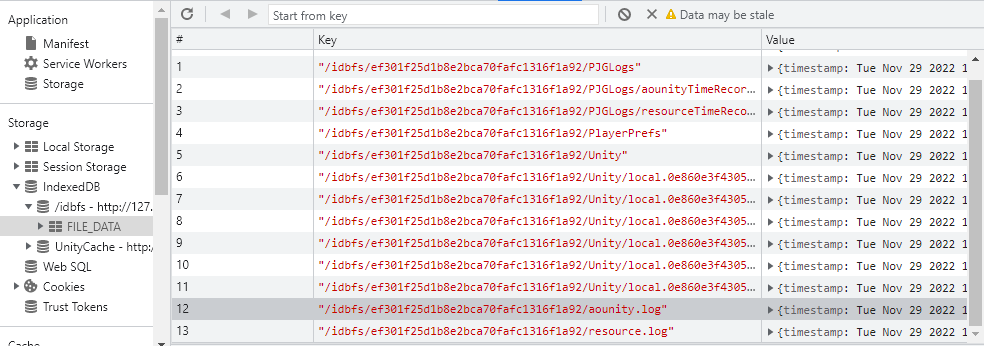

<!-- more -->

## 与日志相关的配置选项

Player Setting-》Other Settings-》Stack Track

可以控制各个日志等级类型的输出，ScriptOnly只包括托管代码（C#、Lua），Full包括托管和非托管代码（C、C++）。

一般debug和release下勾ScriptOnly就够。

Publishing Settings-》Enable Exceptions

runtime下异常捕获的处理方式

-   None：不捕获，异常发生后运行不了
-   Explicitly Thrown Exceptions Only：仅捕获Thrown语句显式调用抛出的异常。
-   Full Without Stacktrace：在上面的基础上加上空引用和数组越界访问异常，并且包含非托管代码的堆栈。
-   Full With Stacktrace：在上面基础上加上捕获堆栈。

以上性能消耗由上都下递增，Full模式只建议调试时使用。

Development Build的js代码不会压缩且具有可读性，但遇到Error或Exception时可以看到堆栈跟踪。

## 文件位置

保存进**Application.persistentDataPath**目录下的文件，会被保存进IndexedDB，位于/idbfs数据库下的FILE\_DATA仓库，包括PlayerPrefs、Unity local文件等，以二进制ArrayBuffer的形式存储。

所以Clogger模块的log日志可以从IndexedDB提取ArrayBuffer，然后解析成string，上报或者导出为Log文件。

IndexedDB没有容量限制。

Demo实现了WebGL导出Log文件，地址点击[这里](https://gitlab.bt/laotuzhu/webgldemo "这里")。
