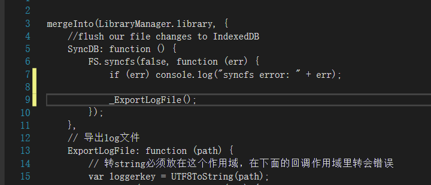
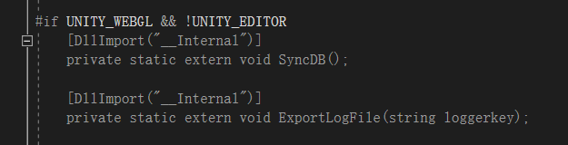
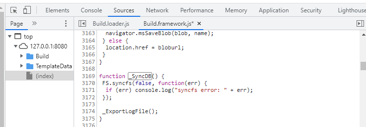
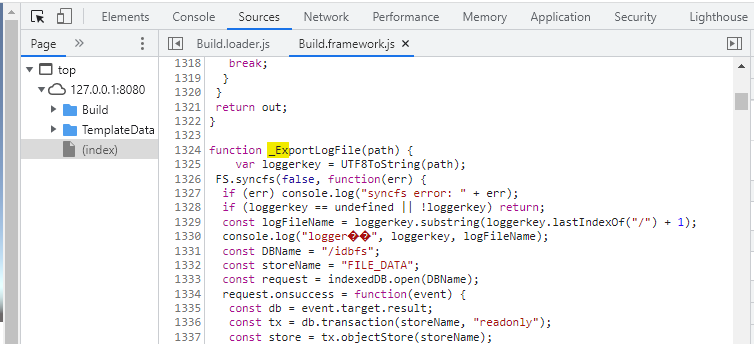
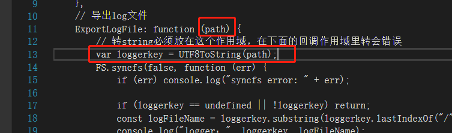

<!-- more -->

官网脚本间的交互[教程](https://docs.unity3d.com/cn/2022.1/Manual/webgl-interactingwithbrowserscripting.html "教程")。

这里提一下注意点：

### 1. jslib的js调用js函数

jslib里嵌入的js函数并且被C# extern导出，被编译进Build.Framework.js下的Module作用域下，在js下的函数名加了\_前缀。

打算在jslib里调用同样自己封装的js函数，需要两步，C#导出以及加上\_前缀。

比如SyncDB函数调用ExportLogFile函数：

编译进js的函数：

### 2.C#传给JS函数的参数转换

JS里拿到的string类型参数是一个内存地址，需要使用UTF8ToString来进行转换。

**注意的是**，不能放在回调下面FS.syncfs的回调作用域内转换，必须放在参数自己的作用域，不然后面地址回收后转出来是不准确的。
