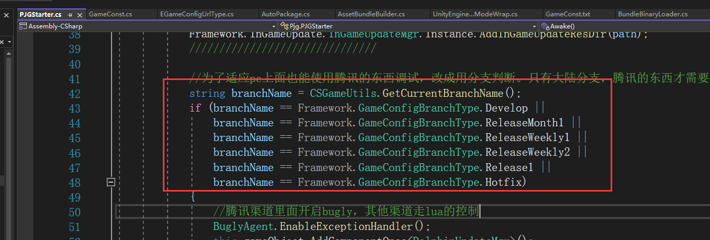
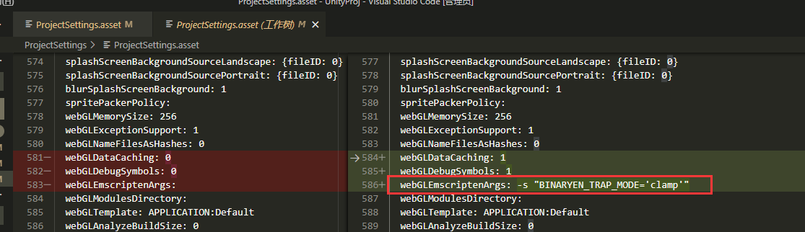

<!-- more -->

## 运行和调试

### 两个起http服务器方案：

-   **Build and Run**

    执行后Unity会起一个http服务器运行web界面，缺点是端口号每次都会变。
-   **自起http服务器**

    利用node的npm包管理器下载http-server插件

```bash
npm install --global http-server
//起一个http服务器
http-server
// 或者，假如打出的包文件时gzip压缩，需加上-g
http-server -g
```

另外需要改http-server插件的一个文件，路径是：C:\Users\\\[yourusername]\AppData\Roaming\npm\node\_modules\http-server\lib\core\index.js

```javascript
// 搜索第一行注释找到这段代码，改为下面代码

//if (file === gzippedFile) { // is .gz picked up
if (file === gzippedFile || path.extname(file) ==".gz") { // is .gz picked up
  res.setHeader('Content-Encoding', 'gzip');
  // strip gz ending and lookup mime type
  contentType = mime.lookup(path.basename(file, '.gz'), defaultType);
//} else if (file === brotliFile) { // is .br picked up
} else if (file === brotliFile || path.extname(file) ==".br") { // is .br picked up  
  res.setHeader('Content-Encoding', 'br');
  // strip br ending and lookup mime type
  contentType = mime.lookup(path.basename(file, '.br'), defaultType);
} 
```

*假如运行http-server命令报未找到命令，需要设置环境变量，添加：C:\Users\[yourUserName]\AppData\Roaming\npm*

### 调试JS

jslib文件插入的js代码会被打包进Build.framework.js里，但只有在C# Extern导出的才会被包含。

调试JS代码可以选择编辑Build.framework.js，加入Debug代码调试，快速方便，跳过打包。

## 打webgl包设置

1.branch选择以下分支之外的分支，跳过MSDK的逻辑，或者可以手改Resources目录下的GameConst.txt下的branch字段。

*20230104:更新：已处理成在国内分支上的MSDK上过滤掉webgl平台。*



2.在PlayerSetting.asset下搜索webGLEmscriptenArgs，手动添加下：webGLEmscriptenArgs: -s "BINARYEN\_TRAP\_MODE='clamp'"

这可以跳过运行时报错：RuntimeError: float unrepresentable in integer range

*20230104:更新：已添加并提交。*



3.打包不要勾选Development Build。

目前Development Build打包编译有报错，还跳跳不过这个坑。

*20230104:更新：编译报错的问题已经找出并解决。*

## 打包配置说明

### [build setting](https://docs.unity3d.com/cn/2022.1/Manual/webgl-building.html "build setting")

Texture Compression：贴图压缩格式

Development build：dev模式构建，开启后链Profiler

Code Optimization：编译优化

-   speed：优化包的运行时性能
-   size：构建包大小优先

### [Player Setting](https://docs.unity3d.com/cn/2022.1/Manual/class-PlayerSettingsWebGL.html "Player Setting")

Resolution And Presentaiton：web页面的游戏窗分辨率设置、模板设置。

Sqlash Image：web tab图标、游戏启动页动画、logo、背景图设置。

Other Settings

-   Auto Graphics API：开启会交由Unity自动根据设备选择webGL图形API。默认WebGL2.0，不支持会回退到WebGL1.0。但Untiy2021.1后将弃用WebGL1.0，可禁用这个选项然后手动添加。

Publishing Setting

-   Compression Format：非dev构建的文件压缩格式，dev构建无作用。**注意服务器nginx要配置支持解压，**[**参考链接**](https://docs.unity3d.com/cn/2022.1/Manual/webgl-server-configuration-code-samples.html "参考链接")**。**
-   Decompression Fallback：勾选会构建包含未压缩的代码，解压失败会回退。
-   Data Caching：开启会自动将内容资源数据缓存在用户计算机上，这样就不必在后续运行中重新下载（除非内容已更改）。缓存是使用浏览器提供的 IndexedDB API 实现的。
-   Debug Symbols：对release包有效，在发生错误时保留调试符号并执行堆栈跟踪的恢复。对于发布版本，所有调试信息都存储在单独的文件中；发生错误时将根据需要从服务器下载该文件(Build/WebGLPackageProj.symbols.json)。开发版本始终具有嵌入在主模块中的恢复支持，因此不受此选项的影响。
