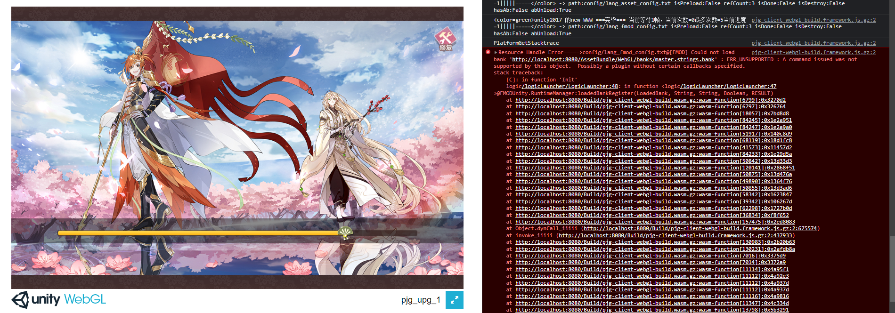

## 前言
Unity使用WebAssembly(wasm)技术将引擎代码和业务代码编译到WebGL平台上解析运行，截止目前2023年，PC浏览器对webgl的支持也越来越兼容普及，并且wasm具有可移植、体积小、加载快等特点，应用运行能接近原生的体验。

为应对项目组拓展海外市场的发展战略，因为海外用户使用PC玩游戏比较多，所以先预研一下发布WebGL平台的整体流程。

这里使用已经上线的项目——食物语来实践，这样遇到的问题比较有代表性。

> 顺便打下广告，食物语是一项集中华传统美食文明和二次元风格于一体的女性向养成卡牌游戏，对美食和二次元感兴趣的同学，非常有必要下载玩玩~~

<!-- more -->

## 总体方向

| 代码模块 | 库模块    | 兼容情况                                                                                 | 完成情况 |
| ---- | ------ | ------------------------------------------------------------------------------------ | ---- |
| ao框架 | 日志     | [日志方案](http://wiki.info/pages/viewpage.action?pageId=139784050 "日志方案")               | ✔    |
|      | 网络     | [使用websocket](http://wiki.info/pages/viewpage.action?pageId=139769721 "使用websocket") | ✔    |
|      | ToLua  | 步骤7                                                                                  | ✔    |
|      | 资源加载   | 步骤20                                                                                 | ✔    |
|      | 资源打包   | 步骤5、6                                                                                | ✔    |
|      | 热更新    |                                                                                      | ⭕    |
|      | Bugly  |                                                                                      | ⭕    |
| 三方库  | Spine  | 支持                                                                                   | ✔    |
|      | Live2D | 支持                                                                                   | ✔    |
|      | Fmod   | 步骤21                                                                                 | ✔    |
|      | Msdk   | 跳过                                                                                   | ✔    |

## 实施步骤

1.移除（剪切到别的目录）AltasSource、GameAssets资源目录，移除ThridParty三方库以及一切业务相关代码，只剩aounity框架相关代码。

2.切换WebGL目标平台

3.编译，解决编译报错

-   注释打包相关的LocalBundleStrategy类
-   注释LocalExportLuaSetting类，将C#类转为Lua类的工具类
-   AssetBundleBuilder调用了上层的类RemoveEmptyDirectory
-   BuglyAgent没有适配webgl平台，空引用报错
-   LuaBinder和DelegateFactoryUtil使用了反射

4.先跑通执行Lua代码，Editor没问题，打包需要解决打包Lua ab问题

5.强打，只打Lua ab，可以正常打出ab，但是web上下载解压有报错。

6.WebGL上不支持解压ab LZMA压缩格式，可以是LZ4，打包选项上得添加ChunkBasedCompression，不然默认打包压缩格式是LZMA。

7.报错dlopen加载库错误、加载tolua DLL错误。这是因为webgl上允许使用动态链接库，Lua相关的库需要通过静态引用C源码的方式，打包时一起编译到webAssembly中。

参考文章[Unity WebGL ToLua](https://zhuanlan.zhihu.com/p/486826570 "Unity WebGL ToLua")，文章里的webgl plugins缺少项目中用到的库，得到[tolua\_runtime](http://tolua_rumtime "tolua_runtime")仓库下载缺失的C文件。

引入lua C源码后打包时会进行Complie WebAssembly Module编译步骤，就是编译刚刚引入的C库文件，假如这时候失败报错python.exe编译报错，则需要检查C文件，修改一下。

**打包过程中发现了两处离奇的编译错误**。


关于bit库问题，luajit内置了，webgl平台需要单独开启，跟mac os类似情况，使用的bit也是luajit作者的

解决编译报错后，成功打出包。**注意：目前tolua c库，只包含lua51，cjson，pbc，pb.c(proto gen), bit.c(luajit作者的bit库), tolua运行时 这几个源码**


**另外编译lua的bytes，webgl是原生lua51，遇到以上jit的lua代码无法编译bytes，所以框架统一删掉，因为一直在客户端都是没有调用jit相关lua脚本的**


**对于源码pbc（实际上框架没有使用只是保留不想改源码调用），webgl平台编译还不识别<>，要改成**""

**另外webassembly编译c, c++代码，代码文件必须放在同一个目录下，不能有子目录，不然对于include的头文件要加相对目录，编译时候也不认，会报错提示找不到文件**

8.FileUtils类添加webgl平台加载ab路径的正确路径，成功加载Lua ab后，输出ab中所有assetName确认加载ab的filename，改写LuaFileUtils.cs获取Lua TextAsset的filename。

9.成功加载和解压Lua ab，tolua框架成功获取lua file buffer数据并成功执行输出log。

10.C#中执行Lua代码成功跑通，接下来跑通Lua执行C#注册的类代码，LuaClient.bind里使用了反射，其实可以直接引用LuaBinder类。去掉LocalExportLuaSetting中缺失引用的类（第三方，pgj等），generate一遍解决C#编译报错。

11.勾选development，打包编译到webAssembly module报错：unresolved symbol ZN14RefcountedData7ReleaseEv、luaopen\_socket\_core、luaopen\_mime\_core、luaopen\_ffi。后面三个项目不用，直接在LuaDll中注释去掉，少了几个报错，但是还有一个。

*20230104更新：*

*通过一步一步删除分拆代码打debug包的方式，逐步缩小问题的范围，发现只有加入ToLua导出的Wrap文件时，才会有出现这个编译错误：error: unresolved symbol: \_ZN14RefcountedData7ReleaseEv。*

*利用二分法进一步缩小范围，最后发现只要编译UnityEngine\_Rendering\_CommandBufferWrap.cs就会报这个错。*

*这个Wrap文件没有在Lua中用到，处理方法可以使用宏过滤掉编译。*


12.打release包，没有注释LuaDll的情况下打包，没有报错，成功打出，真是奇怪，猜测是未引用的库已经剥离了，但是development build认为还需要引用。

13.打包成功，成功执行到Lua业务逻辑，也就是说Lua能执行注册的C#类。

14.验证框架打包资源ab并加载，打包bootstrap的UI view prefab，去掉prefab上的缺失的Script，不然打包报脚本错误，修改LocalBundleStrategy之打包GameAssets/ui/view/下的资源，移除GameAssets/ui/view/bootstrap外的资源，排除其他资源的影响。

15.修改lua代码，跳过热更新逻辑和SDK初始化逻辑，至此webgl已经可以成功加载ui prefab ab，说明框架加载ab资源的能力已经跑通。


16.将所有业务代码，ThirdParty三方库、AltasSource、GameAssets资源目录拉回来，打包ab，解决编译标错后，成功打出ab，但是因为webgl平台的fmod bank需要使用fmod studio重新build，所以缺少bank的ab。

17.build构建，webgl不支持的API会报找出不到namespace报错，Handheld（手持设备）、FullScreenMovieControlMode、FullScreenMovieScalingMode等，这写是toLua export的wrap文件，处理方法是加编译宏。解决build报错后，成功打出包。


成功出包说明了三方库Fmod、Live2Dv2和v4库，Spine都能够在webgl平台上成功编译。

后面通过player publishing settings配置勾选Debug Symbols，打release包输出调试符号表，通过查看符号表可以找到C#dll Live2D库、C源码的toLua库的函数。

说明C、C++源码、C#已经C#编译的DLL文件可以编译进wasm中。


18.至此运行webgl包已经能入Loading页，但是运行时有个报错：RuntimeError: float unrepresentable in integer range，参考这篇[文章](https://blog.csdn.net/ithinking110/article/details/112028638 "文章")，通过设置PlayerSettings.WebGL.emscriptenArgs = “-s “BINARYEN\_TRAP\_MODE=‘clamp’””;解决。

这点之后写入AudoPackage.cs中，根据webgl平台自动化添加PlayerSettings参数。

19.到这里就可以跑到fmod bank的加载逻辑，但是由于缺失bank，报资源加载error。



20.webgl上资源加载重写，使用协程＋UnityWebRequest，去掉框架中的500帧超时重试逻辑，因为在web上调用UnityWebRequest.Abort()中断之后再试的逻辑跑不通，直接利用异步加载，等有结果后返回。

```c#
#if UNITY_WEBGL

  www = getUnityWebRequest (res.RealPath, fullPath);

  yield return www.SendWebRequest();

  if (www.result!=UnityWebRequest.Result.Success)

  {

    Debug.LogErrorFormat("UnityWebRequest加载失败，result{0},error:{1},ab:{2}", www.result, www.error, res.RealPath);

    yield return newWWW (res);

  }

  else

  {

    var ab = DownloadHandlerAssetBundle.GetContent (www);

    if (ab == null) {

      Debug.LogError("DownloadHandlerAssetBundle.GetContent获取null，"+res.RealPath);

    } else {

      Debug.LogFormat("UnityWebRequest加载ab[{0}]成功", res.RealPath);

      res.SetAssetBundle (ab);

    }

  }

#endif
```

AssetBundles中的bank文件是从FmodProj/Build/Mobile中拷贝过来的，至此可以成功加载ab和bank文件了。

21.fmod官方的[unity-html5-demo](https://github.com/fmod/unity-html5-demo "unity-html5-demo")支持webgl平台，但是但是pjg项目运行时播放不了bank，加载没问题就是没有声音。

使用fmod studio将项目中的bank，选择Desktop平台后，build一份到FmodProj/Build/Desktop下，拷贝我们的master和music的一份bank到unity-html-demo项目中，适配代码后Editor上播放有声音没有问题，但是打包到webgl上却播放不出声音。

这个问题我已经到fmod提了[Issues](https://github.com/fmod/unity-html5-demo/issues/4 "Issues")，详细过程请移步查看。

反过来，将unity-html-demo中的master bank拷贝到我们项目中去，验证是不是bank的格式原因导致的。结果还真的可以正常播放，channels 和 volume是正常的，**说明跟构建出来的bank的格式有很大的关系**。


那么项目的bank和demo中的bank有什么区别？最明显的就是项目中的bank使用了encryption key加密，而demo的bank没有加密。

为验证这个问题，用fmod studio去掉encryption key然后重新build bank（这个过程可以删减一部分bank以构建少量数据），最后发现放在demo中能正常播放了。

查下官方文档，发现[LoadFromMemory和encryptionKey不兼容](https://fmod.com/docs/2.02/unity/troubleshooting.html#cannot-fmod_openmemory_point-encrypted-data "LoadFromMemory和encryptionKey不兼容")，而webgl上正是使用LoadFromMemory加载web request请求回来的bank数据。

另外在**webgl上确保使用异步方式加载bank**，否者会报错，而这个报错**假如没有在FmodAssetSettings上开启Enable API Error Logging的话，是不会报出来的，所以调试时候最好开启**。

```c#
[FMOD] System::getEventByID(0x645bd0:{14d7b992-3a9c-4d93-95de-2dfd73fdbf6e}, 0x645ba4) returned ERR_EVENT_NOTFOUND for STUDIO_SYSTEM (0x1FFF1F)
```

为了支持bank加密，可以考虑将bank下载后先存到本地IndexDB，再使用LoadFromFile API读取，但需要考虑版本和加载时间问题。

22.Editor上webSocket已经调通，登录逻辑兼容webgl后，登录成功，至此成功进入到主界面。

23.WebGL上Input输入需要兼容下，Button和GlobalTouchTrigger类点击逻辑走mouse的输入获取，因为pc上不支持移动设备上的touch获取（支持touch api的设备才可以）。

对于键盘的输入捕获要注意下，除了游戏canvas，web界面上的其他Input输入框是捕获不到输入的，因为webgl会拦截捕获，解决需要参考[WebGL Input](https://docs.unity3d.com/2020.3/Documentation/Manual/webgl-input.html "WebGL Input")。

还有多点触碰能力需要兼容下【待处理】。

24.因为webgl development build有问题，所以允许gm按钮在release包上开启。


25\.

```c#
报错：Looks like you are rendering without using requestAnimationFrame for the main loop. You should use 0 for the frame rate in emscripten_set_main_loop in order to use requestAnimationFrame, as that can greatly improve your frame rates!
```

webgl上不建议锁帧，构建的js框架代码会根据设备自动调节。参考[这里](https://forum.unity.com/threads/rendering-without-using-requestanimationframe-for-the-main-loop.373331/ "这里")。
